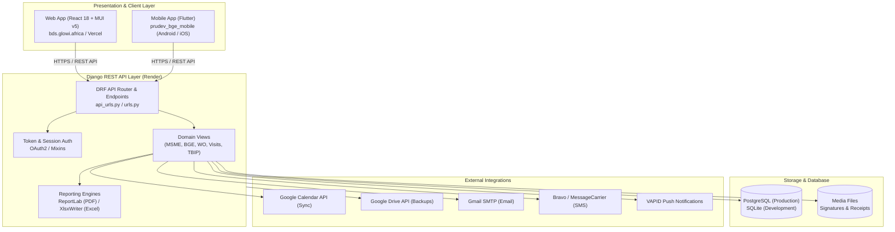

# PRUDEV II Portfolio Manager — System Structure & Architecture

## 1. System Overview

**PRUDEV II Portfolio Manager** is an enterprise Business Development Services (BDS) monitoring, portfolio tracking, and expert contract management platform designed for the **Promoting Rural Development in Northern Uganda (PRUDEV II)** programme, co-financed by the European Union (EU) and the German Federal Ministry for Economic Cooperation and Development (BMZ), implemented by **Deutsche Gesellschaft für Internationale Zusammenarbeit (GIZ) GmbH** in partnership with **GOPA Worldwide Consultants (GOPA Pro)**.

The platform provides end-to-end management for over **240+ MSMEs** across Northern Uganda (West Nile, Acholi, Lango, and Karamoja sub-regions), coordinating **33+ Business Growth Experts (BGEs)**, work orders, field visits, training sessions, diagnostic assessments, enterprise improvement plans, and timesheets.



---

## 2. Repository Directory Topology

```text
/Users/RICHOBUKU/portfolio-manager/
├── .antigravity/                   # Agent rules, architecture, and conventions
│   ├── structure.md                # System structure and module mapping (this file)
│   ├── rules.md                    # Behavioral constraints, security, and invariant rules
│   └── conventions.md              # Code styling, design tokens, and development standards
├── backend/                        # Django 5.2 Application Root
│   ├── backend/                    # Project-level configuration
│   │   ├── settings.py             # App settings, DB routing, CORS, and mail configurations
│   │   ├── urls.py                 # Core routing connecting /api/ and admin
│   │   ├── wsgi.py                 # WSGI entrypoint for Gunicorn
│   │   └── asgi.py                 # ASGI entrypoint
│   ├── portfolio/                  # Primary application module
│   │   ├── models.py               # Domain models (MSME, BGE, WorkOrder, VisitReport, TBIP)
│   │   ├── api_urls.py             # Centralized REST API routing
│   │   ├── views/                  # Modular viewsets and API views
│   │   ├── serializers/            # DRF serializers
│   │   ├── pdf_reports.py          # ReportLab PDF generation engine
│   │   ├── excel_reports.py        # XlsxWriter Excel generation engine
│   │   ├── authentication.py       # Simple token and session authentication handlers
│   │   ├── google_calendar_service.py # Google Calendar API synchronization
│   │   ├── google_drive_service.py # Google Drive backup automation
│   │   ├── sms_service.py          # SMS broadcast engine via MessageCarrier
│   │   ├── ms_graph_email.py       # Microsoft Graph / SMTP mail service
│   │   ├── migrations/             # Django schema migrations (0001 - 0123+)
│   │   └── management/commands/    # CLI management commands (init_admin, export_to_drive)
│   ├── manage.py                   # Django CLI executable
│   └── requirements.txt            # Python dependencies
├── frontend/                       # React 18 Single Page Application
│   ├── public/                     # Static assets, favicon, manifest.json
│   ├── src/
│   │   ├── index.js                # App entrypoint & ServiceWorker registration
│   │   ├── App.js                  # Root application router and role-based shell
│   │   ├── config.js               # Centralized API endpoints and endpoint URL builders
│   │   ├── theme.js                # GIZ & GOPA Pro brand design system palette
│   │   ├── components/             # Reusable UI views and dialogs
│   │   │   ├── Dashboard.js        # Main Programme Manager & Admin portal
│   │   │   ├── BGEDashboard.js     # Field-focused Business Growth Expert mobile portal
│   │   │   ├── EnterpriseImprovementPlanDialog.js # 7-Pillar TBIP diagnostic dialog
│   │   │   ├── CalendarPlanner.js  # Visit calendar with Google Calendar sync
│   │   │   ├── MSMEMap.js          # Interactive Leaflet GIS map with district clustering
│   │   │   ├── MSMEVisitSchedule.js# Chronological visit history and schedule
│   │   │   ├── WorkOrderDialog.js  # Work order drafting, signing, and verification
│   │   │   ├── VisitReportForm.js  # Field visit reporting and signature capture
│   │   │   ├── AssignMsmesDialog.js# Smart MSME-to-BGE matching interface
│   │   │   ├── Login.js            # User login and Google OAuth portal
│   │   │   └── ResetPassword.js    # Password recovery workflow
│   │   └── utils/                  # Helper utilities and data formatters
│   └── package.json                # Frontend dependencies and build scripts
├── prudev_bge_mobile/              # Flutter Cross-Platform Mobile Client
│   ├── lib/                        # Flutter Dart source code
│   ├── android/                    # Android native configuration
│   ├── ios/                        # iOS native configuration
│   └── pubspec.yaml                # Flutter packages and assets
├── render.yaml                     # Render Infrastructure as Code configuration
├── build.sh                        # Build automation script
├── deploy.sh                       # Manual deployment runner
└── README.md                       # High-level repository overview
```

---

## 3. Backend Module Breakdown (`backend/portfolio/`)

### 3.1 Domain Models (`backend/portfolio/models.py`)

| Domain | Key Models | Responsibilities |
| :--- | :--- | :--- |
| **Enterprise Portfolio** | `MSME`, `Cohort`, `ProgrammeGroup`, `MSMEGrowthSnapshot` | Tracks MSME metadata (business name, district, sector, value chain, GPS coordinates, tier), baseline metrics, revenue, and employee counts over time. |
| **Expert Network** | `BusinessGrowthExpert`, `BGEGroup`, `PushSubscription` | Profiles of contracted consultants (specializations, contact, districts, performance score, bank details, signature assets, Web Push tokens). |
| **Field Operations** | `PlannedVisit`, `VisitReportTemplate`, `MSMEReport`, `GroupReport` | Visit scheduling, GPS check-ins, field verification, signature approvals, and structured qualitative/quantitative notes. |
| **Contracts & Billing** | `WorkOrder`, `WorkOrderSubmission`, `WorkOrderPayment`, `WorkOrderAttachment` | Contracting lifecycle: Days allocated (diagnostic, visit, report), total contract value, milestone approvals, invoice/timesheet generation, and payment tracking. |
| **Diagnostics & TBIP** | `EnterpriseImprovementPlan`, `DiagnosticBaseline` | In-depth diagnostic assessment across 7 thematic pillars (Governance, Finance, HR, Marketing, Digital, Environment, Quality), 3-tier scoring, BDS assistance needs, and prioritized roadmap actions. |
| **Capacity Building** | `TrainingTopic`, `TrainingSession`, `TrainingFacilitationAssignment`, `TrainingReport`, `Attendance` | Classroom and group training events, facilitator tracking, attendance logs, and participant feedback. |
| **Logistics** | `TShirtReceipt`, `TShirtReceiptEntry` | PRUDEV II branded visibility asset tracking and field receipt sign-off. |

### 3.2 Modular Views (`backend/portfolio/views/`)

Instead of a monolithic `views.py`, endpoint handlers are partitioned into focused domain modules:

- `msme.py`: MSME listing, filtering by district/sector, CSV/Excel import/export, analytics rollups.
- `bge.py`: Expert profiles, assigned MSMEs, signature upload/rotation/cleanup, performance leaderboard.
- `enterprise_improvement_plan.py`: TBIP CRUD, 7-pillar calculation engine, submission, PM approval/rejection, PDF/Excel export.
- `diagnostic_analytics.py`: Cross-cohort multi-pillar analytics, gap distributions, priority scoring summaries.
- `work_orders.py`: Work order lifecycle (drafting, issuing, BGE countersigning, day submission, payment logging).
- `visit_reports.py`: Visit report submission, manager endorsement, and printable visit report generation.
- `planned_visits.py`: Visit calendar schedule, reschedule requests, completion checks.
- `google_calendar.py`: OAuth flow, calendar channel tokens, and synchronization hooks.
- `smart_assign.py`: Algorithmic MSME allocation to BGEs based on location proximity, value chain, and capacity.
- `training.py` & `training_reports.py`: Facilitator logs, session reporting, attendance exports.
- `tshirt.py`: Visibility item distribution and digital signature collections.
- `users.py` & `auth_views.py`: Authentication, token generation, Google sign-in verification, password resets.
- `mixins.py`: Access control guards (`ProgrammeManagerReadOnlyMixin`, `ViewerReadOnlyMixin`, role predicates).

### 3.3 Reporting Engines

- **`pdf_reports.py`**: Built on ReportLab 4.0 using `SimpleDocTemplate`, `Table`, `Paragraph`, and custom canvas backgrounds (`NumberedCanvas`). Generates official GIZ/GOPA branded PDF documents for:
  - Work Orders (official consulting contracts with legal terms).
  - MSME Visit Reports (endorsed by the GOPA Pro Team Leader).
  - Enterprise Improvement Plans (TBIP) (capacity scores, BDS assistance catalog, prioritized roadmap).
  - Mentor Reports and T-Shirt Distribution Receipts.
- **`excel_reports.py`**: Built on XlsxWriter and OpenPyXL. Generates styled analytical spreadsheets with KPI summary cards, color-coded status cells, and raw diagnostic extracts.

---

## 4. Frontend Component Breakdown (`frontend/src/`)

### 4.1 Routing & Portals (`App.js`)

The React application uses React Router v6 with role-based routing:
- `/dashboard`: Primary portal for Programme Managers and System Administrators.
- `/bge`: Dedicated lightweight interface optimized for Business Growth Experts in the field.
- `/login`, `/reset-password`: Authentication interfaces.

### 4.2 Core View Components (`frontend/src/components/`)

1. **`Dashboard.js`**:
   - Central operations console featuring multi-tab views: Overview KPIs, MSME Portfolio directory, BGE Network, Work Orders & Timesheets, Diagnostic Baselines, Reports & Verification, and Settings.
2. **`BGEDashboard.js`**:
   - Field view allowing an expert to review assigned MSMEs, log planned visits, draft and submit Enterprise Improvement Plans (TBIP), record visit reports with signatures, and download monthly billing invoices.
3. **`EnterpriseImprovementPlanDialog.js`**:
   - 7-pillar interactive diagnostic tool.
   - Computes weighted readiness scores in real-time.
   - Features 1-click auto-detection of technical assistance needs from identified diagnostic gaps.
   - Structured action roadmap manager with sequential ranking (`Rank #1`, `Rank #2`...), priority levels, BGE support day allocations, and means of verification.
4. **`CalendarPlanner.js`**:
   - Calendar interface supporting monthly, weekly, and daily visit planning with Google Calendar synchronization.
5. **`MSMEMap.js`**:
   - Leaflet map rendering MSME geographic coordinates with status markers, district cluster views, and quick navigation popups.
6. **`WorkOrderDialog.js`**:
   - Multi-step modal for issuing BGE contracts, allocating diagnostic/visit/report days, signing digital signatures, and recording payment vouchers.

---

## 5. Mobile Client Architecture (`prudev_bge_mobile/`)

- Built with Flutter 3.x for Android and iOS.
- Enables field experts to:
  - Access assigned MSME directories without constant internet connectivity.
  - Record visit notes and photograph documentation in offline mode.
  - Synchronize data automatically with the Django backend upon network availability.

---

## 6. External Service Pipelines & Integrations

1. **Google Calendar API**:
   - Two-way synchronization of planned BDS visits. Enables BGEs to view their programme assignments in their personal Google Calendars.
2. **Google Drive API**:
   - Daily cron job executed at 02:00 UTC (05:00 EAT) on Render (`python manage.py export_to_drive`) uploading encrypted database snapshots and exports to secure programme cloud storage.
3. **Email Notification Pipeline**:
   - Outbound notifications (password reset, work order issuance, BGE welcome packs) routed via Gmail SMTP (`richobuku@gmail.com`) with `Reply-To: richard.obuku@gopa.eu`.
4. **Bulk SMS Messaging**:
   - Field alerts and visit reminders dispatched through MessageCarrier / Bravo API directly to feature phones of rural MSME proprietors.
5. **VAPID Web Push**:
   - Real-time browser notifications for work order approvals and visit endorsements via `pywebpush`.
