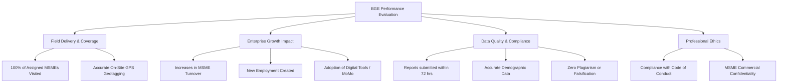
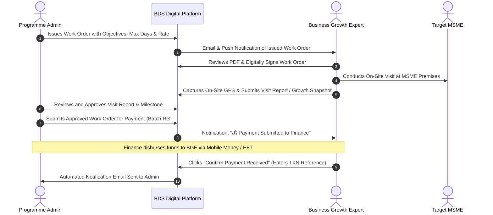

# PRUDEV II BDS PROGRAMME
## Terms of Reference (TOR) for Business Growth Experts (BGEs)
### Business Development Services (BDS) Delivery & Enterprise Growth Advisory

---

| **Document Information** | **Details** |
| :--- | :--- |
| **Programme** | Promoting Rural Development in Northern Uganda – Phase II (PRUDEV II) |
| **Component** | Business Development Services (BDS) & Enterprise Mentorship |
| **Role Title** | Business Growth Expert (BGE) / Enterprise Development Advisor |
| **Duty Station** | Northern Uganda (Acholi, Lango, and West Nile Sub-regions) |
| **Target Locations** | Gulu, Lira, Kitgum, Adjumani, Arua, Nebbi, Yumbe, Oyam, Dokolo, Kole, Alebtong, Otuke, Amuru, Nwoya, Lamwo, Pader, Zombo, Koboko, Moyo, Obongi, Madi-Okollo, Terego |
| **Supervising Authority** | BDS Programme Manager / Team Leader |
| **Digital MIS Portal** | [https://bds.glowi.africa](https://bds.glowi.africa) |
| **Contractual Instrument** | Individual Work Orders with Milestone-Based Deliverables |

---

## 1. Programme Background & Context

The **Promoting Rural Development in Northern Uganda – Phase II (PRUDEV II)** programme aims to foster inclusive socio-economic growth, climate resilience, and sustainable employment creation across Northern Uganda. The **Business Development Services (BDS)** component provides direct, customized coaching, business diagnostics, financial linkages, operational mentoring, and capacity building to Micro, Small, and Medium Enterprises (MSMEs) and Farmer Producer Organizations.

To drive enterprise growth and resilience, **Business Growth Experts (BGEs)** are deployed as hands-on field advisors who directly support assigned MSMEs and enterprise groups. This document outlines the updated Terms of Reference (TOR), operational standards, digital reporting obligations, and compliance protocols governing all BGE assignments.

---

## 2. Core Purpose of the Assignment

The primary purpose of the Business Growth Expert (BGE) is to deliver high-quality, practical, and measurable business coaching and mentoring to assigned MSMEs and Producer Groups. BGEs facilitate enterprise development in key areas including:
- Strategic planning and operational improvements
- Financial record-keeping, cash flow management, and digital payments adoption (e.g. MTN MoMo Pay / Airtel Money)
- Business Continuity Planning (BCP) and climate risk mitigation
- Regulatory formalization (URSB business registration, UNBS product certification, tax compliance)
- Market linkages, supply chain enhancement, and revenue growth tracking
- Inclusivity mainstreaming (women-led, youth-led, and refugee-inclusive businesses)

---

## 3. Scope of Work and Key Responsibilities

BGEs are responsible for executing structured interventions across six key task areas:

### Task 1: Enterprise Diagnostic & Baseline Profiling
1. Conduct comprehensive diagnostic assessments of newly assigned MSMEs to identify operational gaps, cash flow bottlenecks, market challenges, and growth potential.
2. Establish baseline benchmarks for each enterprise, including annual turnover, permanent/casual employee numbers, banking/MoMo status, and formal registration standing.
3. Formulate individualized **Enterprise Improvement Action Plans** tailored to the enterprise's sector and capacity.

### Task 2: One-on-One Technical Advisory & Growth Mentoring
1. Conduct regular, structured advisory visits to assigned MSMEs at their physical business premises.
2. Deliver hands-on coaching on:
   - Bookkeeping, cost analysis, pricing strategy, and profit/loss calculation.
   - Inventory control, post-harvest handling, quality assurance, and packaging.
   - Digital financial services integration (mobile money merchant accounts, bank linkages).
   - Compliance with statutory standards (URSB, UNBS, URA tax clearance, local government trading licenses).
3. Track and record quarterly growth updates (revenue changes, new jobs created, capital investments unlocked).

### Task 3: Group Support & Collective BDS Sessions
1. Facilitate cluster and group sessions for MSMEs in shared sectors or value chains (e.g. Agroprocessors, Farm Enterprises, Green Businesses, Produce Bulking).
2. Facilitate Business Continuity Planning (BCP) workshops, financial literacy clinics, and peer-to-peer knowledge exchanges.
3. Accurately document attendance for all group interactions with mandatory demographic disaggregation (gender, age bracket/youth, refugee/host status, and participant consent).

### Task 4: Mandatory Field Verification & On-Site GPS Geotagging
1. **On-Site Physical Presence**: All individual MSME assessments and follow-up visits must occur in-person at the enterprise's physical premises.
2. **GPS Geotagging Requirement**: During physical visits, the BGE must capture exact GPS coordinates (Latitude & Longitude) directly through the BDS Digital Platform at the MSME premises (with special focus on coverage across Lira, Adjumani, Kitgum, Gulu, Arua, and surrounding hubs).
3. **BGE Base GPS Pin**: Set and maintain an up-to-date base operational pin on the platform for spatial logistics planning and route optimization.

### Task 5: Digital Reporting via the BDS Platform
1. Record and submit all field activities exclusively via the official PRUDEV II BDS Management Information System ([https://bds.glowi.africa](https://bds.glowi.africa)).
2. Complete and submit all **MSME Visit Reports** (Initial, Follow-up, Final, Annual Review) within **48 to 72 hours** of completing the field interaction.
3. Submit comprehensive **Group Support Reports** and **Participant Training Reports**, attaching photographic evidence, signed attendance registers, and verified outputs.

### Task 6: Work Order Management & Payment Confirmation
1. Review and digitally sign issued Work Orders prior to assignment commencement.
2. Submit signed timesheets, milestone deliverables, and activity invoices in accordance with the Work Order schedule.
3. **Payment Receipt Acknowledgment**: Promptly confirm receipt of payment disbursements on the portal upon receiving funds from the programme finance team.

---

## 4. Key Deliverables and Output Schedule

| # | Deliverable | Description / Standard | Timeline / Deadline | Verification Instrument |
| :---: | :--- | :--- | :--- | :--- |
| **D1** | **Signed Work Order** | Digital acceptance of issued Work Order on the BDS platform. | Within 3 days of Work Order issuance | Digital signature & timestamp in MIS |
| **D2** | **MSME Diagnostic & Baseline Reports** | Detailed diagnostic reports for all newly assigned MSMEs with baseline turnover, employee data, and GPS pin. | Within 14 days of assignment start | Digital MSME Report (Initial Assessment) |
| **D3** | **Follow-up Coaching & Growth Reports** | Visit reports documenting advisory delivered, actions taken, and financial/operational metrics updated. | Within 48–72 hours after each field visit | Digital MSME Visit Report + Growth Snapshot |
| **D4** | **Group Support & Training Reports** | Group session documentation including objectives, modules covered, photos, and disaggregated attendance. | Within 5 days of session completion | Group Report + Attendee Demographic Register |
| **D5** | **Milestone Timesheets & Invoices** | Consolidated milestone timesheets and invoices matching approved work days and rate per day. | End of milestone / monthly cycle | Work Order Timesheet & Invoice Submission |
| **D6** | **Payment Receipt Confirmation** | Digital confirmation of funds received (specifying transaction ID and date). | Within 24 hours of funds disbursement | Portal Payment Confirmation ✓ |

---

## 5. Performance Indicators and Quality Standards (KPIs)

BGE performance will be appraised against the following indicators:

1. **Visit Completion Rate**: At least 95% of assigned MSMEs visited and mentored according to the work plan.
2. **GPS Geotag Compliance**: 100% of verified reports must have valid on-site coordinates captured from the enterprise premises.
3. **Turnover & Job Creation Impact**: Evidence of measurable positive change in supported MSMEs (e.g. improved bookkeeping, cost savings, growth in revenue, or workforce expansion).
4. **Digital Financial Inclusion**: Facilitating the onboarding of supported MSMEs onto digital financial solutions (mobile money merchant codes, banking channels).
5. **Reporting Timeliness**: Zero backlog of unsubmitted draft reports older than 7 calendar days.

---

## 6. Digital Workflow on the BDS Platform

BGEs must adhere to the standardized digital workflow enabled on [https://bds.glowi.africa](https://bds.glowi.africa):

---

## 7. Required Qualifications & Professional Competencies

1. **Education**: Bachelor’s degree in Business Administration, Agribusiness, Economics, Entrepreneurship, Finance, Commerce, or related disciplines.
2. **Experience**: Minimum of 3–5 years of demonstrable field experience in business mentoring, MSME coaching, agribusiness development, or value chain advisory in Northern Uganda.
3. **Local Language Fluency**: Strong working proficiency in English and local languages spoken across target districts (e.g. Luo / Acholi, Lango, Lugbara, Madi, or Alur).
4. **Digital Literacy**: Proficiency in operating web-based Management Information Systems (MIS), digital mobile data collection tools, spreadsheet reporting, and smartphone GPS navigation.
5. **Mobility**: Ability and willingness to travel extensively to rural and peri-urban enterprise sites across assigned project districts.

---

## 8. Code of Conduct, Ethics & Safeguarding

All BGEs must uphold the highest standards of integrity, professionalism, and ethical conduct:

1. **Commercial Confidentiality**: All financial statements, operational records, and business strategies of supported MSMEs must be treated with strict confidentiality and must never be shared with third parties or competitors.
2. **Data Integrity & Zero Falsification**: Fabricating visit records, forging attendee signatures, submitting duplicate photos, or manipulating GPS coordinates constitutes gross misconduct resulting in immediate contract termination and financial recovery.
3. **No Fees or Kickbacks**: BGEs are strictly prohibited from demanding, soliciting, or receiving any fees, goods, or gratuities from target MSMEs for services funded under PRUDEV II.
4. **Gender Equity, Inclusion & Safeguarding**: BGEs must maintain a zero-tolerance policy against sexual harassment, exploitation, abuse, discrimination, and child labour. Inclusive respect must be accorded to all entrepreneurs, including women, youth, persons with disabilities (PWDs), and refugees.
5. **Conflict of Interest**: BGEs must declare any direct commercial or familial interests in any assigned enterprise prior to delivering advisory services.

---

## 9. Contractual Arrangements, Invoicing & Payment Terms

1. **Engagement Modality**: BGEs are engaged on a short-term consultant / expert basis under specific Work Orders defining maximum allowable days, rate per day (UGX), and duration.
2. **Withholding Tax (WHT)**: All payments are subject to statutory withholding tax deductions in accordance with Uganda Revenue Authority (URA) regulations (e.g., 6% WHT for registered local service providers).
3. **Payment Triggers**: Payments are processed upon:
   - Approval of submitted field visit reports and milestone deliverables by the Programme Management team.
   - Verification of accompanying timesheets and invoices submitted through the platform.
   - Formal submission into the programme financial payment batches.
4. **Disbursement Channels**: Official disbursements are made via verified Mobile Money numbers (Airtel Money / MTN Mobile Money) or Electronic Funds Transfer (EFT) to the BGE's registered bank account.

---

*Approved by Programme Management – PRUDEV II BDS Component*  
*GOPA Worldwide Consultants / GIZ Partner Programme*
